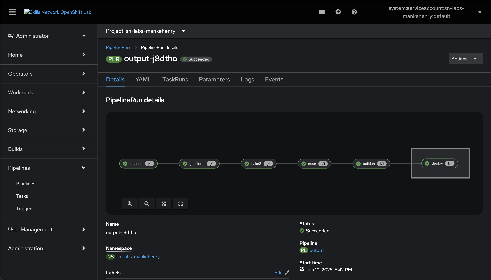
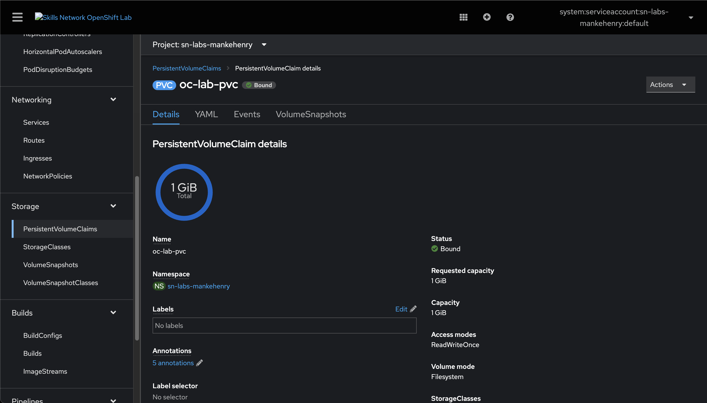
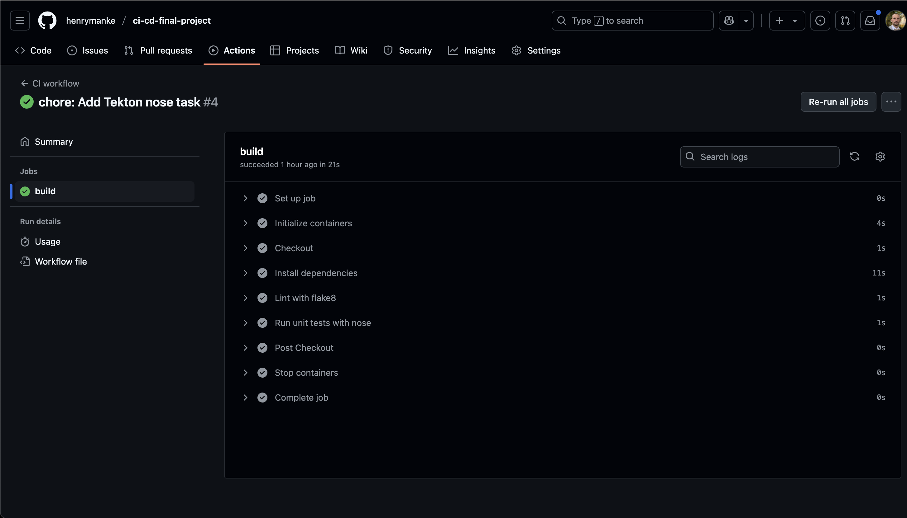
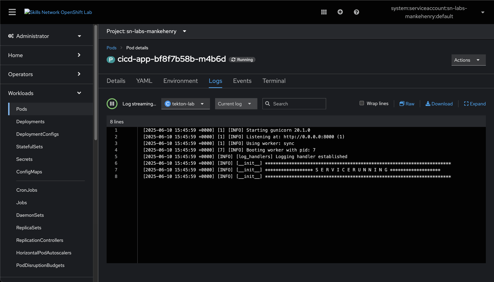

# OpenShift CI/CD Submission

This document demonstrates the implementation of a full CI/CD pipeline using **OpenShift Pipelines with Tekton**. It showcases the use of OpenShift components, custom tasks, and GitHub integration as part of the final project delivery.

---

## 🧩 Project Overview

This project implements a fully functional CI/CD pipeline in OpenShift with the following steps:

1. **Cleanup Workspace**  
2. **Clone Git Repository from GitHub**  
3. **Run Python Linter (flake8)**  
4. **Execute Unit Tests (nose)**  
5. **Build Docker Image with Buildah**  
6. **Deploy the Application to OpenShift**

Each task is defined via Tekton and executed in sequence with a shared workspace named `output`.

---

## 📸 Screenshots

### ✅ OpenShift Pipeline



See full: [`pipeline.yml`](https://github.com/henrymanke/ci-cd-final-project/blob/main/openshift/pipeline.yml)

### 📦 PVC Details



### 🧪 GitHub Actions Run (Validation)



### 📋 Application Logs in OpenShift



---

## 📂 Repository

- ✅ GitHub Repository: [`ci-cd-final-project`](https://github.com/henrymanke/ci-cd-final-project)

- ✅ Workflow file (lint + test):  
  [`workflow.yml`](https://github.com/henrymanke/ci-cd-final-project/blob/main/.github/workflows/workflow.yml)

- ✅ Tekton task definitions:  
  [`tasks.yml`](https://github.com/henrymanke/ci-cd-final-project/blob/main/.tekton/tasks.yml)

- ✅ OpenShift pipline yaml:
  [`pipeline.yml`](https://github.com/henrymanke/ci-cd-final-project/blob/main/openshift/pipeline.yml)

---

## 🗃️ PVC Configuration

To enable persistent storage across pipeline steps, a **PersistentVolumeClaim** (PVC) was created in the OpenShift Console:

- Name: `oc-lab-pvc`  
- Size: `1Gi`  
- StorageClass: `skills-network-learner`

It is mounted into each task using the workspace `output`.

---

## 🔧 Tasks Used in the Pipeline

| Task Name   | Description                                              |
|------------|----------------------------------------------------------|
| `cleanup`  | Clears any leftover files in the shared workspace.       |
| `git-clone`| Clones the GitHub repository using Tekton's git task.    |
| `flake8`   | Runs Python linter using `flake8`.                       |
| `nose`     | Runs unit tests using `nose`.                            |
| `buildah`  | Builds and pushes container image using unprivileged Buildah. |
| `deploy`   | Uses `openshift-client` to deploy the built image.       |

---

## 🚀 Final Pipeline Definition

The pipeline is defined using the `tekton.dev/v1` API and includes `params`, `tasks`, a `finally` deploy step, and the shared `workspaces`.

```yaml
Tasks:
  - cleanup
  - git-clone
  - flake8
  - nose
  - buildah
Finally:
  - deploy (openshift-client)
````

---

## 📦 Built Container Image

The application is successfully built and pushed to:

```plaintext
image-registry.openshift-image-registry.svc:5000/sn-labs-mankehenry/tekton-lab:latest
```

It is then deployed to the OpenShift cluster using:

```bash
oc create deployment $(params.app-name) --image=$(params.build-image) --dry-run=client -o yaml | oc apply -f -
```

---

## 💻 Git Commands Used

```bash
git config --local user.email "you@example.com"
git config --local user.name "Your Name"

git add .
git commit -m "Final OpenShift pipeline submission"
git push origin main
```

GitHub PAT was used for authentication in the Cloud IDE.

---

## ✅ Summary

This project demonstrates a working OpenShift CI/CD pipeline using Tekton, GitHub, and container image build/deployment automation.

Key concepts shown:

- Tekton task chaining
- Shared persistent workspace
- Automated testing and linting
- Unprivileged Buildah image build
- Deployment using `openshift-client`

This confirms hands-on knowledge in OpenShift CI/CD and GitHub integration.
